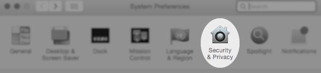
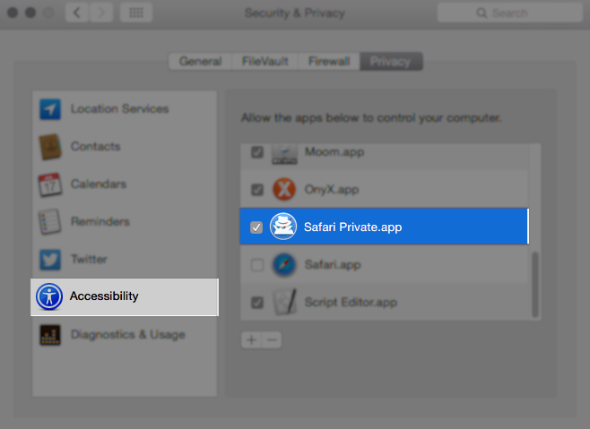

# safari-private
Instantly make the current page private.

# usage
To go private: launch application, the current tab will be reopened in a private window. 

##note
All other tabs besides the current window will be closed.


# install
Copy the app from the dmg, and add the app to assistive devices.





# implementation

```applescript
property theURL : ""

tell application "Safari"
	set theURL to URL of current tab of window 1
end tell
set IsDefined to true
try
	get theURL
on error
	set IsDefined to false
end try

if IsDefined then
	tell application "System Events"
		tell process "Safari"
			click menu item "Close All Windows" of menu "File" of menu bar 1
			click menu item "New Private Window" of menu "File" of menu bar 1
		end tell
	end tell

	tell application "Safari"
		tell window 1
			open location theURL
		end tell
		activate

	end tell
	tell application "System Events"
		tell process "Safari"
			click menu item "Close Tab" of menu "File" of menu bar 1
		end tell
	end tell
end if
```
